# FlashInfer Heterogeneity Benchmark

## Overview

Compares two strategies for handling heterogeneous batches in FlashInfer:
- **Mixed**: Single wrapper processing all requests
- **Bucketed**: Separate wrappers for homogeneous request groups

## Key Finding

Mixed approach wins in 35 of 39 experiments (89.7%). Bucketed only wins when there are exactly 2 buckets with very different request sizes, where tile size optimization benefits outweigh kernel launch overhead.

## Scenarios

### 1. Long Prefill + Short Prefill (lp1_sp1)

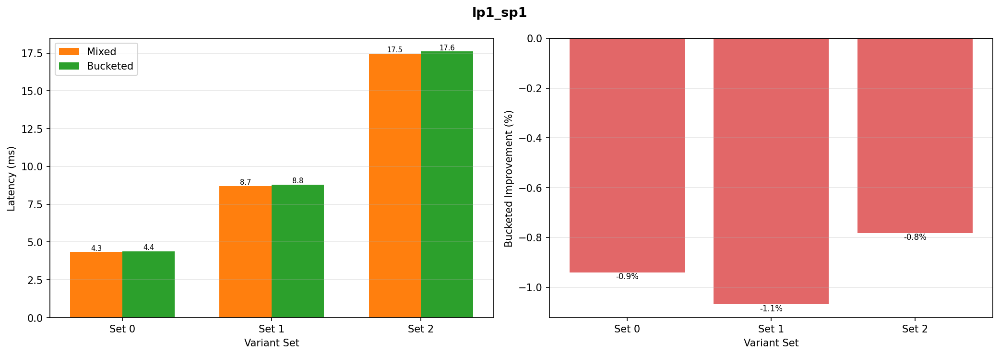

### 2. Long Prefill + 8 Short Prefills (lp1_sp8)

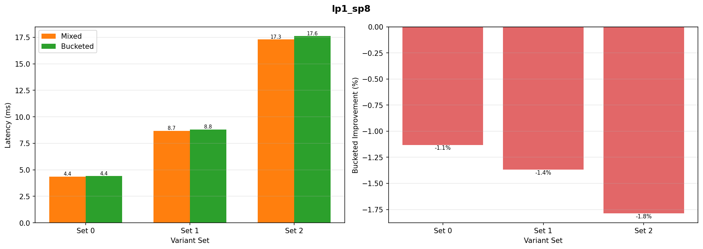

### 3. Long Prefill + 64 Short Decodes (lp1_sd64)

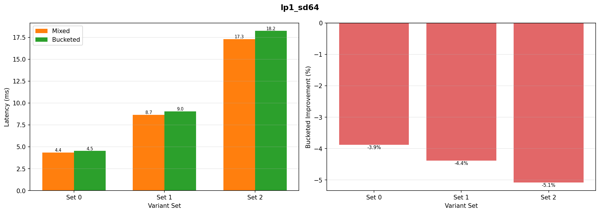

### 4. Short Prefill + 64 Short Decodes (sp1_sd64)

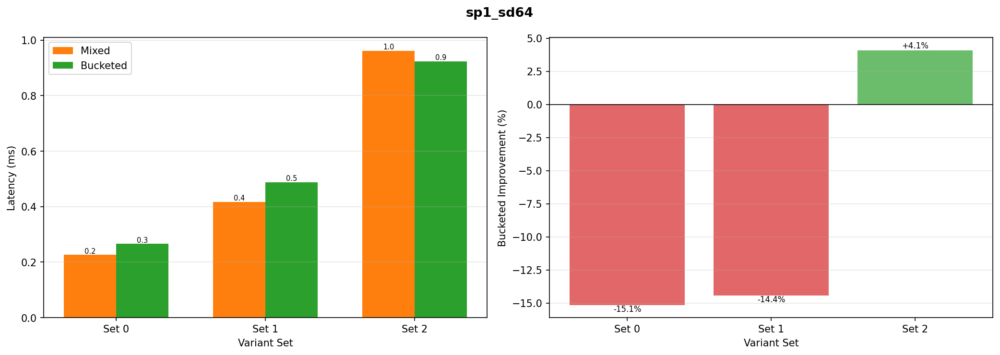

### 5. Long Decode + 64 Short Decodes (ld1_sd64)

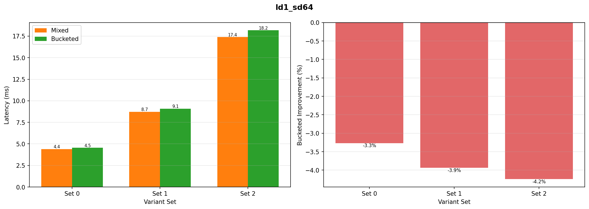

### 6. Long Prefill + Long Decode + 32 Short Decodes (lp1_ld1_sd32)

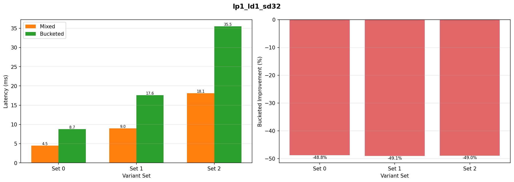

### 7. Full Mix (full_mix)

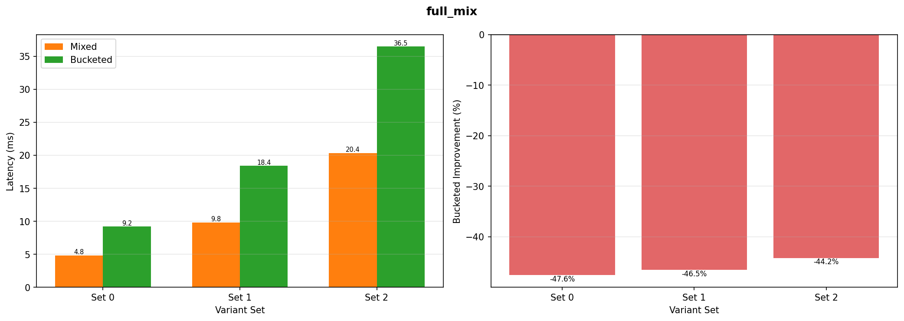

### 8. Flipping Cases (flipping_cases) - Bucketed Wins

**Setup**: Two very long prefills with different KV lengths (1M + 2M)
- Mixed: 70.04 ms
- Bucketed: 54.17 ms (22.6% faster)

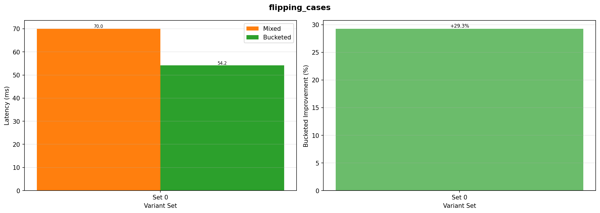

Might not be a practically relevant scenario, since at such large context lenghts, we'd do chunked prefill so q_tokens would not be this large.

### 9. Varied Q, Fixed KV (varied_q_fixed_kv)

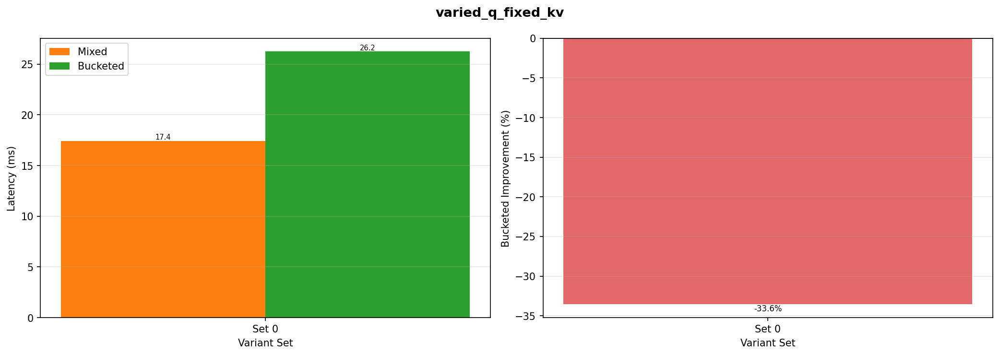

### 10. Multiple Fixed KV (multiple_fixed_kv)

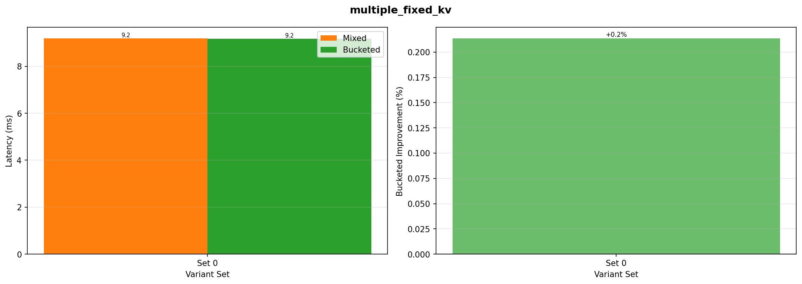

### 11. Bimodal KV Distribution (bimodal_kv_distribution)

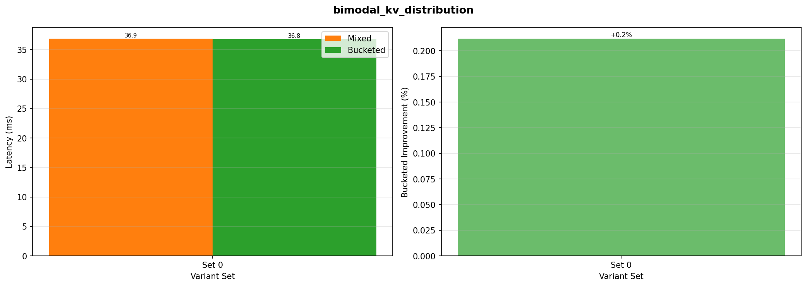

### 12. Extreme Bimodal KV (extreme_bimodal_kv)

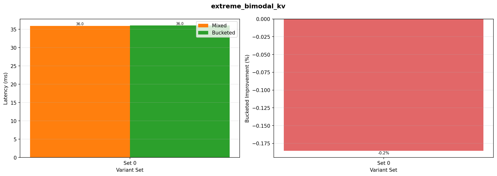

### 13. Multimodal KV Distribution (multimodal_kv_distribution)

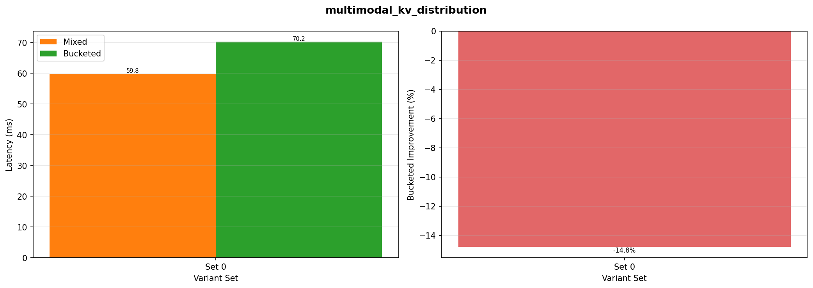

### 14. Small Chunk (16q) + 32 Short Decodes (small_chunk_q16_sd32)

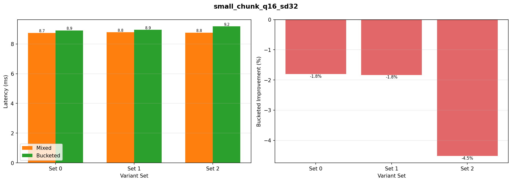

### 15. Small Chunk (32q) + 32 Short Decodes (small_chunk_q32_sd32)

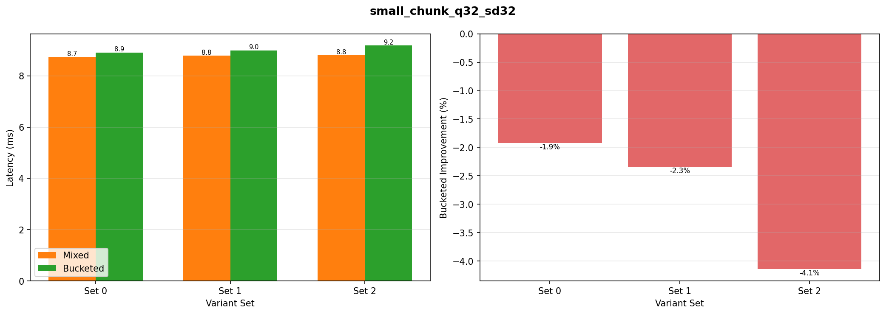

### 16. Small Chunk (16q) + 64 Short Decodes (small_chunk_q16_sd64)

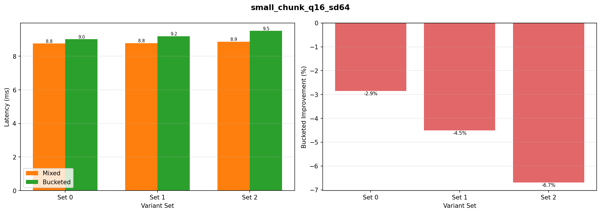

### 17. Small Chunk (32q) + 64 Short Decodes (small_chunk_q32_sd64)

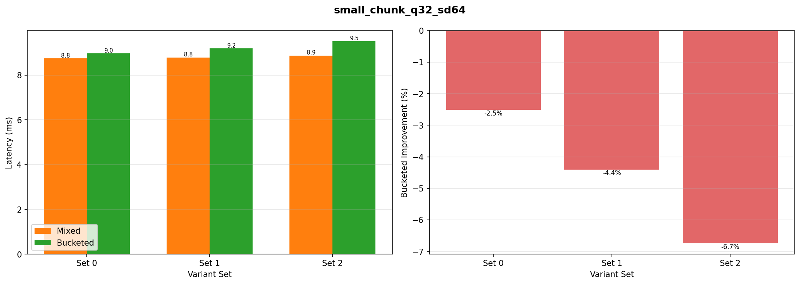

### 18. Mixed Small Chunks (mixed_small_chunks)

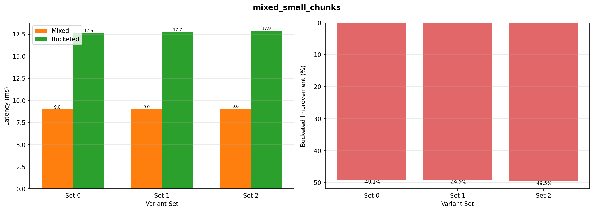

## Running the Benchmark

```bash
# Run all experiments
python flashinfer_heterogeneity/run_benchmark.py

# Custom config
python flashinfer_heterogeneity/run_benchmark.py --config path/to/config.yaml
```

**Output**:
- `results/results_TIMESTAMP.json` - Raw data
- `plots/comparison_by_scenario.png` - Performance comparison
- `plots/speedup_by_scenario.png` - Speedup analysis
- `plots/per_scenario/*.png` - Individual scenario plots

## Configuration

See [config.yaml](config.yaml) for full configuration.

**Variants**: Request types with token counts
```yaml
prefill_q512_kv512k:
  q_tokens: 512
  kv_tokens: 524288
  description: "Long prefill (512 q, 512K kv)"
```

**Scenarios**: Workload compositions
```yaml
lp1_sp1:
  name: "1 Long Prefill + 1 Short Prefill"
  variants_to_run:
    - prefill_q128_kv2k: 1
      prefill_q256_kv256k: 1
```
